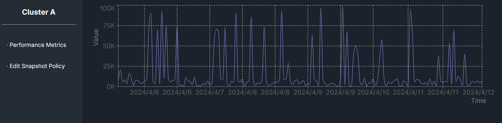

## Prerequisites
You must first install this repository [cluster-monitor-server](https://github.com/SenjorWhite/cluster-monitor-server) and run it in the same environment to ensure the cluster-monitor-client's chart data displays correctly

## Getting Started

Install and run the development server:

```bash
npm install
npm run dev
```

Open [http://localhost:3000](http://localhost:3000) with your browser to see the result.


### Currently, only the most basic data setup, API integration, and layout have been completed.



## TODO
### Primary
* Fine-tune CSS details
* Implement cluster selection functionality
* Ensure all traffic data is properly integrated
* Develop Snapshot page and all related API interactions
* Implement responsive UI
### Secondary
* Resolve Recharts warnings
* Set up CSS theming approach